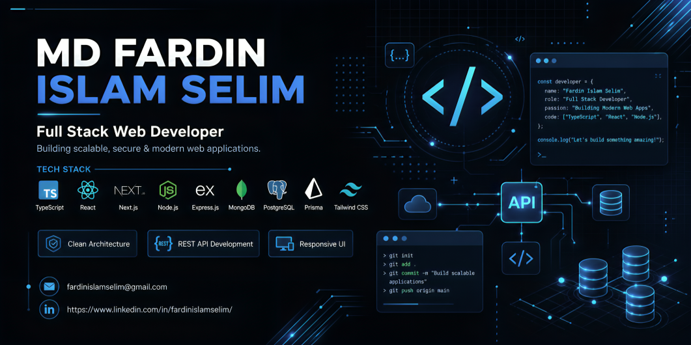

 

# Md Fardin Islam Selim

### 💻 Full Stack Web Developer &nbsp;|&nbsp; 🇧🇩 Bangladesh

  

 

  

 

## 🚀 About Me

- 🔭 **Currently Focused On:** Building scalable full-stack applications with the MERN + Next.js ecosystem
- 🌱 **Currently Learning:** System Design, Docker, AWS & Microservices
- 🎯 **Career Goal:** Becoming a Senior Full Stack / Software Engineer
- ❤️ **Passion:** Turning complex problems into simple, elegant, and secure code
- ⚡ **Fun Fact:** I debug faster with coffee ☕ in hand
- 🤝 **Open to Collaboration:** Open-source projects & impactful web products
- 🌍 **Remote Friendly:** Yes — available for remote & freelance work
- 💼 **Looking for Opportunities:** Full Stack Developer roles (Remote / Bangladesh)

 

━━━━━━━━━━━━━━━━━━━━━━━━━━━━━━━━━━━━━━━━━━━━━━━━━━━━━━━━━━━━━━━━━━━━━━

## 🛠 Tech Stack

**Frontend**

**Backend**

**Database**

**Tools & Platforms**

━━━━━━━━━━━━━━━━━━━━━━━━━━━━━━━━━━━━━━━━━━━━━━━━━━━━━━━━━━━━━━━━━━━━━━

## 🏆 GitHub Achievements

 

 

━━━━━━━━━━━━━━━━━━━━━━━━━━━━━━━━━━━━━━━━━━━━━━━━━━━━━━━━━━━━━━━━━━━━━━

## 📈 Coding Activity

  

 

━━━━━━━━━━━━━━━━━━━━━━━━━━━━━━━━━━━━━━━━━━━━━━━━━━━━━━━━━━━━━━━━━━━━━━

## 📚 Current Learning Roadmap

| Topic | Progress |
|---|---|
| ⚡ Advanced Next.js | ████████████░░░░░░░░ 60% |
| 🏗️ System Design | ██████████░░░░░░░░░░ 50% |
| 🐳 Docker | ████████░░░░░░░░░░░░ 40% |
| 🔁 CI / CD | ███████░░░░░░░░░░░░░ 35% |
| 🧠 Redis | ██████░░░░░░░░░░░░░░ 30% |
| 🧩 Microservices | █████░░░░░░░░░░░░░░░ 25% |
| ☁️ AWS | ████░░░░░░░░░░░░░░░░ 20% |
| ✅ Testing | ██████░░░░░░░░░░░░░░ 30% |

━━━━━━━━━━━━━━━━━━━━━━━━━━━━━━━━━━━━━━━━━━━━━━━━━━━━━━━━━━━━━━━━━━━━━━

## 🎯 2026 Goals

- ✅ Build enterprise-grade applications
- ✅ Learn Kubernetes
- ✅ Master System Design
- ✅ Become an Open Source Contributor
- ✅ Publish technical blogs
- ✅ Learn AWS
- ✅ Learn Docker
- ✅ Master CI/CD
- ✅ Land a Senior Software Engineer role

━━━━━━━━━━━━━━━━━━━━━━━━━━━━━━━━━━━━━━━━━━━━━━━━━━━━━━━━━━━━━━━━━━━━━━

## 🌐 Connect With Me

━━━━━━━━━━━━━━━━━━━━━━━━━━━━━━━━━━━━━━━━━━━━━━━━━━━━━━━━━━━━━━━━━━━━━━

## 💬 Favorite Quote

> _"Code is like humor. When you have to explain it, it's bad."_
> — **Cory House**

━━━━━━━━━━━━━━━━━━━━━━━━━━━━━━━━━━━━━━━━━━━━━━━━━━━━━━━━━━━━━━━━━━━━━━

### 👋 Thanks for visiting my profile!

### 🚀 Let's build something amazing together.

⭐️ From <b>Md Fardin Islam Selim</b> — crafted with care.

